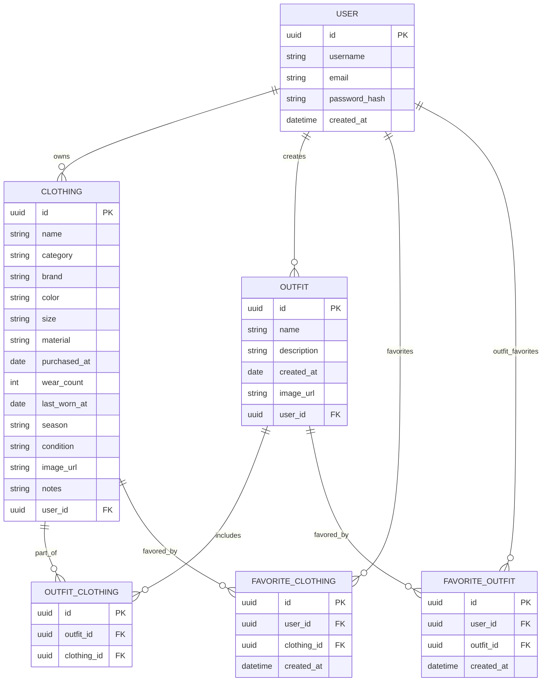

# HukuLog
前から話してた電子クローゼット。
コーデ管理が簡単に！みたいなやつ

## 📝 各テーブルの構成（実装ガイドつき）

### 🔹 `USER`

| カラム名            | 型         | 説明           |
| --------------- | --------- | ------------ |
| `id`            | UUID (PK) | ユーザーID       |
| `username`      | string    | ユーザー名        |
| `email`         | string    | メールアドレス      |
| `password_hash` | string    | パスワード（ハッシュ化） |
| `created_at`    | datetime  | 登録日          |

---

### 🔹 `CLOTHING`

| カラム名           | 型         | 説明         |
| -------------- | --------- | ---------- |
| `id`           | UUID (PK) | 服のID       |
| `name`         | string    | アイテム名      |
| `category`     | string    | トップス／靴など   |
| `brand`        | string    | ブランド名      |
| `color`        | string    | 色          |
| `size`         | string    | S／M／Lなど    |
| `material`     | string    | 綿／ウールなど    |
| `purchased_at` | date      | 購入日        |
| `wear_count`   | int       | 着用回数       |
| `last_worn_at` | date      | 最後に着た日     |
| `season`       | string    | 春／夏など      |
| `condition`    | string    | 新品／やや傷ありなど |
| `image_url`    | string    | 写真URL      |
| `notes`        | string    | メモ         |
| `user_id`      | UUID (FK) | 所有ユーザー     |

---

### 🔹 `OUTFIT`

| カラム名          | 型         | 説明     |
| ------------- | --------- | ------ |
| `id`          | UUID (PK) | コーデID  |
| `name`        | string    | コーデ名   |
| `description` | string    | メモ・説明  |
| `created_at`  | date      | 登録日    |
| `image_url`   | string    | コーデ画像  |
| `user_id`     | UUID (FK) | 作成ユーザー |

---

### 🔹 `OUTFIT_CLOTHING`（中間テーブル）

| カラム名          | 型         | 説明             |
| ------------- | --------- | -------------- |
| `id`          | UUID (PK) | 主キー（もしくは複合PK可） |
| `outfit_id`   | UUID (FK) | 紐付けるコーデ        |
| `clothing_id` | UUID (FK) | 紐付ける服          |

---

### ⭐ `FAVORITE_CLOTHING`

| カラム名          | 型         | 説明          |
| ------------- | --------- | ----------- |
| `id`          | UUID (PK) | 主キー         |
| `user_id`     | UUID (FK) | お気に入りしたユーザー |
| `clothing_id` | UUID (FK) | お気に入りされた服   |
| `created_at`  | datetime  | 登録日時        |

---

### ⭐ `FAVORITE_OUTFIT`

| カラム名         | 型         | 説明          |
| ------------ | --------- | ----------- |
| `id`         | UUID (PK) | 主キー         |
| `user_id`    | UUID (FK) | お気に入りしたユーザー |
| `outfit_id`  | UUID (FK) | お気に入りされたコーデ |
| `created_at` | datetime  | 登録日時        |

---

## 📝 コメント・補足（Mermaid外で整理）

### 👤 `USER`

* ユーザー基本情報
* `password_hash` にしてセキュリティ対応済み
* 今後 SNS連携やプロフィール画像を追加してもOK

---

### 👚 `CLOTHING`

* 服の詳細情報（ブランド、色、サイズなど）
* 着用回数や最終着用日も管理できる
* `image_url` で服の写真表示対応
* `user_id` 外部キーで所有ユーザーと紐づけ

---

### 👗 `OUTFIT`

* コーデ名＋説明を登録できる
* 複数の服を紐づける中間テーブル `OUTFIT_CLOTHING` を通じて管理
* `image_url` でコーデ全体の見た目を保存可能

---

### 🔀 `OUTFIT_CLOTHING`

* OutfitとClothingのM\:N関係を担う中間テーブル
* 1つの服が複数のコーデに含まれてもOK
* 並び順が欲しいなら `order` カラムなども追加可

---

### ❤️ `FAVORITE_CLOTHING`

* 服単位でのお気に入り
* `user_id` + `clothing_id` にユニーク制約を設けると便利（重複防止）

---

### ❤️‍🔥 `FAVORITE_OUTFIT`

* コーデ単位でのお気に入り
* こちらも `user_id` + `outfit_id` にユニーク制約を設けると◎

