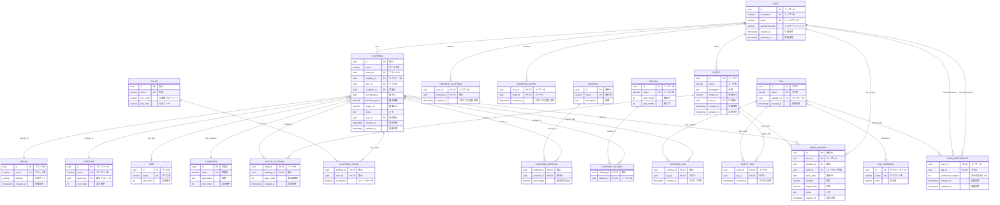

```mermaid
erDiagram
    %% ユーザー関連
    USER ||--o{ CLOTHING : owns
    USER ||--o{ OUTFIT : creates
    USER ||--o{ FAVORITE_CLOTHING : favorites
    USER ||--o{ FAVORITE_OUTFIT : favorites
    USER ||--o{ USER_PREFERENCE : has_preferences

    %% 服とコーデの関連
    OUTFIT ||--o{ OUTFIT_CLOTHING : contains
    CLOTHING ||--o{ OUTFIT_CLOTHING : included_in
    
    %% 服の属性（正規化済み）
    CLOTHING }o--|| BRAND : belongs_to
    CLOTHING }o--|| CATEGORY : belongs_to
    CLOTHING }o--|| SIZE : has_size
    CLOTHING }o--|| CONDITION : has_condition
    
    %% 多対多関係
    CLOTHING ||--o{ CLOTHING_COLOR : has_colors
    COLOR ||--o{ CLOTHING_COLOR : color_of
    
    CLOTHING ||--o{ CLOTHING_MATERIAL : made_of
    MATERIAL ||--o{ CLOTHING_MATERIAL : material_of
    
    CLOTHING ||--o{ CLOTHING_SEASON : suitable_for
    SEASON ||--o{ CLOTHING_SEASON : season_of
    
    %% タグシステム
    CLOTHING ||--o{ CLOTHING_TAG : tagged_with
    OUTFIT ||--o{ OUTFIT_TAG : tagged_with
    TAG ||--o{ CLOTHING_TAG : tags_clothing
    TAG ||--o{ OUTFIT_TAG : tags_outfit
    TAG }o--|| TAG_CATEGORY : belongs_to
    
    %% ユーザー設定
    USER ||--o{ USER_PREFERENCE : has_preferences
    TAG ||--o{ USER_PREFERENCE : preferred_by
    
    %% 使用履歴
    USER ||--o{ WEAR_HISTORY : has_history
    CLOTHING ||--o{ WEAR_HISTORY : worn_in
    OUTFIT ||--o{ WEAR_HISTORY : outfit_worn

    USER {
        uuid id PK "ユーザーID"
        varchar username UK "ユーザー名"
        varchar email UK "メールアドレス"
        varchar password_hash "パスワードハッシュ"
        timestamp created_at "作成日時"
        timestamp updated_at "更新日時"
    }

    CLOTHING {
        uuid id PK "服ID"
        varchar name "アイテム名"
        uuid brand_id FK "ブランドID"
        uuid category_id FK "カテゴリーID"
        uuid size_id FK "サイズID"
        uuid condition_id FK "状態ID"
        date purchased_at "購入日"
        decimal purchase_price "購入価格"
        varchar image_url "画像URL"
        text notes "メモ"
        uuid user_id FK "所有者ID"
        timestamp created_at "登録日時"
        timestamp updated_at "更新日時"
    }

    OUTFIT {
        uuid id PK "コーデID"
        varchar name "コーデ名"
        text description "説明"
        varchar image_url "画像URL"
        uuid user_id FK "作成者ID"
        timestamp created_at "作成日時"
        timestamp updated_at "更新日時"
    }

    BRAND {
        uuid id PK "ブランドID"
        varchar name UK "ブランド名"
        varchar website "公式サイト"
        timestamp created_at "作成日時"
    }

    CATEGORY {
        uuid id PK "カテゴリーID"
        varchar name UK "カテゴリー名"
        uuid parent_id FK "親カテゴリーID"
        int sort_order "表示順序"
    }

    COLOR {
        uuid id PK "色ID"
        varchar name UK "色名"
        varchar hex_code "16進数カラーコード"
        varchar rgb_code "RGBコード"
    }

    MATERIAL {
        uuid id PK "素材ID"
        varchar name UK "素材名"
        text description "説明"
    }

    SEASON {
        uuid id PK "シーズンID"
        varchar name UK "シーズン名"
        int start_month "開始月"
        int end_month "終了月"
    }

    SIZE {
        uuid id PK "サイズID"
        varchar name UK "サイズ名"
        int sort_order "表示順序"
    }

    CONDITION {
        uuid id PK "状態ID"
        varchar name UK "状態名"
        text description "説明"
        int sort_order "表示順序"
    }

    TAG_CATEGORY {
        uuid id PK "タグカテゴリーID"
        varchar name UK "カテゴリー名"
        varchar color "表示色"
    }

    TAG {
        uuid id PK "タグID"
        varchar name UK "タグ名"
        uuid category_id FK "カテゴリーID"
        timestamp created_at "作成日時"
    }

    %% 中間テーブル
    OUTFIT_CLOTHING {
        uuid outfit_id PK,FK "コーデID"
        uuid clothing_id PK,FK "服ID"
        int layer_order "重ね着順序"
        timestamp created_at "追加日時"
    }

    CLOTHING_COLOR {
        uuid clothing_id PK,FK "服ID"
        uuid color_id PK,FK "色ID"
        boolean is_primary "メインカラーか"
    }

    CLOTHING_MATERIAL {
        uuid clothing_id PK,FK "服ID"
        uuid material_id PK,FK "素材ID"
        decimal percentage "素材の割合(%)"
    }

    CLOTHING_SEASON {
        uuid clothing_id PK,FK "服ID"
        uuid season_id PK,FK "シーズンID"
    }

    CLOTHING_TAG {
        uuid clothing_id PK,FK "服ID"
        uuid tag_id PK,FK "タグID"
        timestamp created_at "タグ付け日時"
    }

    OUTFIT_TAG {
        uuid outfit_id PK,FK "コーデID"
        uuid tag_id PK,FK "タグID"
        timestamp created_at "タグ付け日時"
    }

    %% お気に入り
    FAVORITE_CLOTHING {
        uuid user_id PK,FK "ユーザーID"
        uuid clothing_id PK,FK "服ID"
        timestamp created_at "お気に入り登録日時"
    }

    FAVORITE_OUTFIT {
        uuid user_id PK,FK "ユーザーID"
        uuid outfit_id PK,FK "コーデID"
        timestamp created_at "お気に入り登録日時"
    }

    %% ユーザー設定
    USER_PREFERENCE {
        uuid user_id PK,FK "ユーザーID"
        uuid tag_id PK,FK "タグID"
        int preference_weight "好みの重み(1-10)"
        timestamp created_at "設定日時"
        timestamp updated_at "更新日時"
    }

    %% 着用履歴
    WEAR_HISTORY {
        uuid id PK "履歴ID"
        uuid user_id FK "ユーザーID"
        uuid clothing_id FK "服ID"
        uuid outfit_id FK "コーデID（任意）"
        date worn_date "着用日"
        varchar weather "天気"
        decimal temperature "気温"
        text notes "メモ"
        timestamp created_at "記録日時"
    }
```