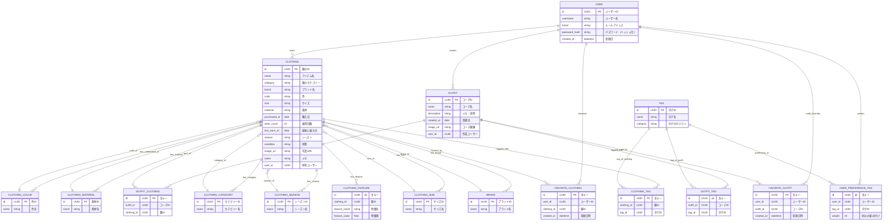

```mermaid
erDiagram
USER ||--o{ CLOTHING : owns
USER ||--o{ OUTFIT : creates
OUTFIT ||--o{ OUTFIT_CLOTHING : includes
CLOTHING ||--o{ OUTFIT_CLOTHING : part_of

USER ||--o{ FAVORITE_CLOTHING : favorites
CLOTHING ||--o{ FAVORITE_CLOTHING : favored_by

USER ||--o{ FAVORITE_OUTFIT : outfit_favorites
OUTFIT ||--o{ FAVORITE_OUTFIT : favored_by

CLOTHING ||--o{ CLOTHING_COLOR : has_color
CLOTHING_COLOR ||--o{ CLOTHING : color_of

CLOTHING ||--o{ CLOTHING_MATERIAL : has_material
CLOTHING_MATERIAL ||--o{ CLOTHING : material_of

CLOTHING ||--o{ CLOTHING_CATEGORY : has_category
CLOTHING_CATEGORY ||--o{ CLOTHING : category_of

CLOTHING ||--o{ CLOTHING_SEASON : has_season
CLOTHING_SEASON ||--o{ CLOTHING : season_of

CLOTHING ||--o{ CLOTHING_SIZE : has_size
CLOTHING_SIZE ||--o{ CLOTHING : size_of

CLOTHING ||--o{ BRAND : has_brand
BRAND ||--o{ CLOTHING : brand_of

CLOTHING ||--o{ CLOTHING_TAG : tagged_with
TAG ||--o{ CLOTHING_TAG : tag_of_clothing

OUTFIT ||--o{ OUTFIT_TAG : tagged_with
TAG ||--o{ OUTFIT_TAG : tag_of_outfit

USER ||--o{ USER_PREFERENCE_TAG : prefers
TAG ||--o{ USER_PREFERENCE_TAG : preference_of

CLOTHING ||--o{ CLOTHING_FEATURE : has_feature
    
USER {
  id UUID PK "ユーザーID"
  username string "ユーザー名"
  email string "メールアドレス"
  password_hash string "パスワード（ハッシュ化）"
  created_at datetime "登録日"
}

CLOTHING {
  id UUID PK "服のID"
  name string "アイテム名"
  category string "服のカテゴリー"
  brand string "ブランド名"
  color string "色"
  size string "サイズ"
  material string "素材"
  purchased_at date "購入日"
  wear_count int "着用回数"
  last_worn_at date "最後に着た日"
  season string "シーズン"
  condition string "状態"
  image_url string "写真URL"
  notes string "メモ"
  user_id UUID "所有ユーザー"
}

OUTFIT {
  id UUID PK "コーデID"
  name string "コーデ名"
  description string "メモ・説明"
  created_at date "登録日"
  image_url string "コーデ画像"
  user_id UUID "作成ユーザー"
}

OUTFIT_CLOTHING {
  id UUID PK "主キー"
  outfit_id UUID "コーデID"
  clothing_id UUID "服ID"
}

FAVORITE_CLOTHING {
  id UUID PK "主キー"
  user_id UUID "ユーザーID"
  clothing_id UUID "服ID"
  created_at datetime "登録日時"
}

FAVORITE_OUTFIT {
  id UUID PK "主キー"
  user_id UUID "ユーザーID"
  outfit_id UUID "コーデID"
  created_at datetime "登録日時"
}

CLOTHING_COLOR {
  id UUID PK "色ID"
  name string "色名"
}

CLOTHING_MATERIAL {
  id UUID PK "素材ID"
  name string "素材名"
}

CLOTHING_CATEGORY {
  id UUID PK "カテゴリーID"
  name string "カテゴリー名"
}

CLOTHING_SEASON {
  id UUID PK "シーズンID"
  name string "シーズン名"
}

CLOTHING_SIZE {
  id UUID PK "サイズID"
  name string "サイズ名"
}

BRAND {
  id UUID PK "ブランドID"
  name string "ブランド名"
}

TAG {
  id UUID PK "タグID"
  name string "タグ名"
  category string "タグのカテゴリ"
}

CLOTHING_TAG {
  id UUID PK "主キー"
  clothing_id UUID "服ID"
  tag_id UUID "タグID"
}

OUTFIT_TAG {
  id UUID pk "主キー"
  outfit_id UUID "コーデID"
  tag_id UUID "タグID"
}

USER_PREFERENCE_TAG {
  id UUID pk "主キー"
  user_id UUID "ユーザーID"
  tag_id UUID "タグID"
  weight int "好みの重み付け"
}

CLOTHING_FEATURE {
  id UUID pk "主キー"
  clothing_id UUID "服ID"
  feature_name string "特徴名"
  feature_value float "特徴値"
}
```